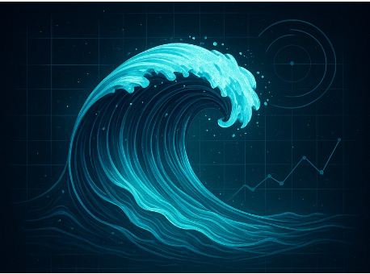

# PROJET C-WildWater

##  Table des matières

- [Introduction](#Introduction)
- [Pré-requis](#Pré-requis)
- [Guide d'installation](#Guide-d'installation)
- [Guide d'utilisation](#Guide-d'utilisation)
- [Structure du Projet](#Structure-du-projet)
- [Auteurs](#Auteurs)

## Introduction 📝
  L'objectif de ce projet est de modéliser un réseau de distribution d'eau en analysant le parcours de l'eau, de sa captation jusqu'à la consommation finale.
  
## Pré-requis
  - Make

## Guide d'installation 📔 
